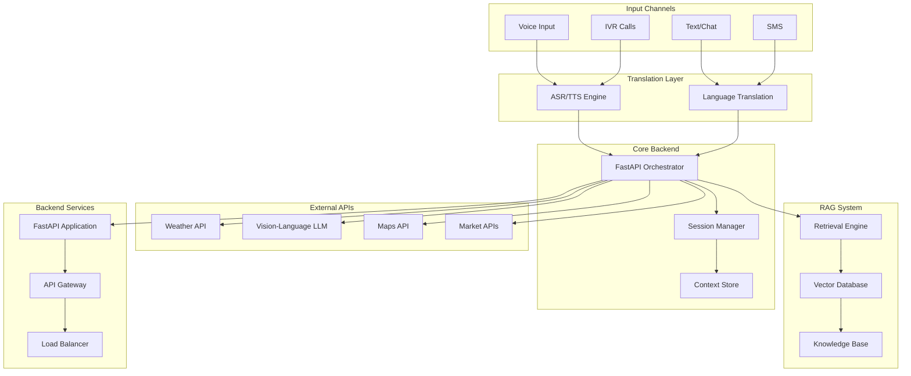
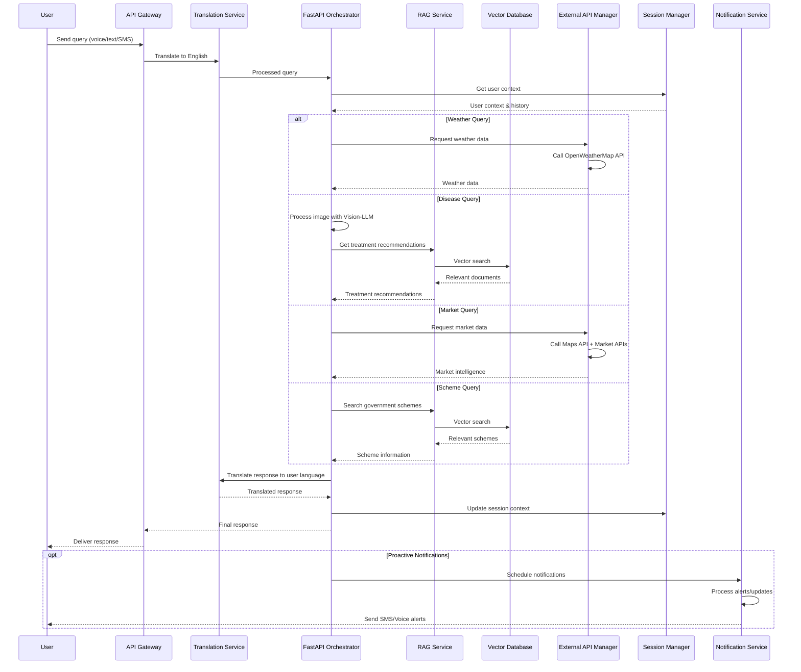

# Design Document: AI-Driven Agri-Civic Intelligence Platform

## Overview

The AI-driven agri-civic intelligence platform is a comprehensive multilingual system that leverages Large Language Models (LLMs) and Retrieval-Augmented Generation (RAG) to deliver actionable agricultural intelligence to farmers and rural communities. The platform provides a unified translation-layer architecture that processes inputs from multiple channels (voice, text, SMS, IVR) in regional languages, translates them to English for consistent LLM processing, and delivers responses back in the user's preferred language.

The system integrates multiple external APIs (weather, disease detection, maps, market data) with a robust RAG engine built on a vector database containing government schemes, agricultural advisories, and market intelligence. This design ensures hallucination-resistant, source-grounded responses while maintaining scalability and performance.

## Design Decisions and Rationales

### 1. Unified Translation Architecture

**Decision**: All regional language inputs are translated to English for LLM processing, then responses are translated back to the user's preferred language.

**Rationale**: This approach ensures consistent LLM performance across languages while supporting multilingual users. English-based processing leverages the strongest LLM capabilities, and the translation layer handles regional language nuances. This addresses Requirements 1.1-1.3 and 4.3.

### 2. FastAPI as Central Orchestrator

**Decision**: Use FastAPI as the primary backend framework to coordinate all LLM interactions and services.

**Rationale**: FastAPI provides high-performance async capabilities essential for LLM API calls, automatic API documentation, and excellent Python ecosystem integration. It enables the 3-second response time requirement (11.4) through efficient request handling and supports horizontal scaling (11.5).

### 3. RAG-First Knowledge Architecture

**Decision**: Implement RAG with vector database as the primary knowledge retrieval mechanism, grounding all responses in source documents.

**Rationale**: This prevents LLM hallucination by ensuring all factual claims are traceable to authoritative sources. The vector database enables semantic search across government schemes, agricultural advisories, and market data, directly addressing Requirements 6.2-6.4.

### 4. Multi-Channel Response Optimization

**Decision**: Implement channel-specific response formatting with different content strategies for SMS, IVR, and chat.

**Rationale**: Each channel has unique constraints - SMS requires concise messages, IVR needs clear voice responses, and chat supports rich content. This ensures optimal user experience across different technological capabilities, addressing Requirements 7.5 and 8.6.

### 5. Proactive Notification System

**Decision**: Implement LLM-powered notification generation for weather alerts, MSP updates, and scheme notifications.

**Rationale**: Proactive information delivery is crucial for timely agricultural decisions. LLM-generated notifications can be personalized and contextually relevant, addressing Requirements 7.1-7.4 for SMS services and supporting farmer decision-making.

### 6. Vision-Language Model Integration

**Decision**: Use vision-language LLMs (like GPT-4V) for crop disease identification rather than specialized computer vision models.

**Rationale**: Vision-language models provide contextual understanding and can generate detailed explanations alongside disease identification. This enables natural language interaction about crop health and integrates seamlessly with the RAG system for treatment recommendations, addressing Requirements 3.1-3.5.

### 7. Hybrid Database Architecture

**Decision**: Use PostgreSQL for structured data and vector database (Pinecone/Weaviate) for knowledge base.

**Rationale**: This hybrid approach optimizes for different data types - relational data for user profiles and sessions, vector storage for semantic search. It supports both transactional operations and AI-powered knowledge retrieval efficiently.

### 8. Circuit Breaker Pattern for External APIs

**Decision**: Implement circuit breaker patterns with cached fallback data for all external API integrations.

**Rationale**: Rural connectivity can be unreliable, and external APIs may fail. Circuit breakers prevent cascade failures while cached data ensures continued service availability, directly addressing Requirement 10.6 for graceful degradation.

## Architecture

### High-Level Architecture



### Production-Grade Architecture

```mermaid
graph TB
    subgraph "Client Layer"
        CL1[Mobile Apps]
        CL2[Web Interface]
        CL3[SMS Gateway]
        CL4[IVR System]
    end
    
    subgraph "CDN & Load Balancing"
        CDN[CloudFlare CDN]
        ALB[Application Load Balancer]
        NLB[Network Load Balancer]
    end
    
    subgraph "API Gateway Layer"
        AG1[API Gateway - Primary]
        AG2[API Gateway - Secondary]
        RL[Rate Limiter]
        AUTH[Authentication Service]
    end
    
    subgraph "Microservices Layer"
        MS1[Translation Service]
        MS2[FastAPI Orchestrator]
        MS3[RAG Service]
        MS4[Session Manager]
        MS5[External API Manager]
        MS6[Notification Service]
    end
    
    subgraph "Data Processing Layer"
        DP1[Message Queue - Redis]
        DP2[Event Streaming - Kafka]
        DP3[Background Workers]
        DP4[Batch Processing]
    end
    
    subgraph "AI/ML Layer"
        AI1[LLM Cluster - GPT/Claude]
        AI2[Vision-Language Models]
        AI3[Translation Models]
        AI4[Embedding Models]
    end
    
    subgraph "Data Storage Layer"
        DS1[PostgreSQL - Primary]
        DS2[PostgreSQL - Replica]
        DS3[Vector DB - Pinecone]
        DS4[Redis Cache]
        DS5[S3 Object Storage]
    end
    
    subgraph "External Services"
        EXT1[OpenWeatherMap API]
        EXT2[Google Maps API]
        EXT3[Market Data APIs]
        EXT4[Government Portals]
        EXT5[SMS Provider]
        EXT6[Voice Provider]
    end
    
    subgraph "Monitoring & Observability"
        MON1[Prometheus]
        MON2[Grafana]
        MON3[ELK Stack]
        MON4[Jaeger Tracing]
        MON5[AlertManager]
    end
    
    CL1 --> CDN
    CL2 --> CDN
    CL3 --> NLB
    CL4 --> NLB
    CDN --> ALB
    NLB --> ALB
    ALB --> AG1
    ALB --> AG2
    AG1 --> RL
    AG2 --> RL
    RL --> AUTH
    AUTH --> MS1
    AUTH --> MS2
    AUTH --> MS3
    AUTH --> MS4
    AUTH --> MS5
    AUTH --> MS6
    
    MS1 --> AI3
    MS2 --> AI1
    MS3 --> AI4
    MS3 --> DS3
    MS4 --> DS4
    MS5 --> EXT1
    MS5 --> EXT2
    MS5 --> EXT3
    MS5 --> EXT4
    MS6 --> EXT5
    MS6 --> EXT6
    
    MS2 --> DP1
    MS3 --> DP1
    MS5 --> DP2
    DP1 --> DP3
    DP2 --> DP4
    
    MS4 --> DS1
    DS1 --> DS2
    MS2 --> DS4
    MS3 --> DS5
    
    MS2 --> AI2
    
    MS1 --> MON1
    MS2 --> MON1
    MS3 --> MON1
    MS4 --> MON1
    MS5 --> MON1
    MS6 --> MON1
    MON1 --> MON2
    MON1 --> MON5
```



### Data Flow Architecture



### Component Architecture

The platform follows a microservices architecture with the following key components:

1. **API Gateway**: Routes requests and handles authentication
2. **FastAPI Orchestrator**: Central backend service managing all LLM interactions and coordinating services
3. **Translation Service**: Handles multilingual input/output processing
4. **RAG Engine**: Manages knowledge retrieval and response generation
5. **External API Manager**: Handles third-party service integrations
6. **Session Manager**: Maintains user context and conversation state
7. **Multi-Channel Interface**: Supports various input/output modalities

### Infrastructure Components

#### Load Balancing & CDN
- **CloudFlare CDN**: Global content delivery and DDoS protection
- **Application Load Balancer**: Distributes traffic across service instances
- **Network Load Balancer**: Handles high-throughput SMS/IVR traffic

#### API Gateway Layer
- **Primary/Secondary Gateways**: High availability with automatic failover
- **Rate Limiting**: Prevents abuse and ensures fair usage
- **Authentication Service**: JWT-based authentication with refresh tokens

#### Microservices Infrastructure
- **Container Orchestration**: Kubernetes for service deployment and scaling
- **Service Mesh**: Istio for inter-service communication and security
- **Auto-scaling**: Horizontal Pod Autoscaler based on CPU/memory metrics

#### Data Processing
- **Message Queue (Redis)**: Real-time message processing and caching
- **Event Streaming (Kafka)**: Asynchronous event processing and data pipeline
- **Background Workers**: Celery workers for batch processing tasks

#### AI/ML Infrastructure
- **LLM Cluster**: Distributed deployment of language models with load balancing
- **GPU Acceleration**: NVIDIA A100/H100 GPUs for model inference
- **Model Serving**: TensorRT/vLLM for optimized model serving

#### Data Storage Strategy
- **PostgreSQL Cluster**: Primary-replica setup with automatic failover
- **Vector Database**: Pinecone/Weaviate for semantic search capabilities
- **Redis Cache**: Multi-tier caching for session data and API responses
- **Object Storage**: S3-compatible storage for images, documents, and backups

#### Monitoring & Observability
- **Metrics**: Prometheus for metrics collection and alerting
- **Visualization**: Grafana dashboards for system monitoring
- **Logging**: ELK stack for centralized log management
- **Tracing**: Jaeger for distributed request tracing
- **Alerting**: AlertManager for incident response

## Components and Interfaces

### FastAPI Orchestrator

The FastAPI Orchestrator serves as the central backend service that coordinates all LLM interactions and manages the overall system workflow.

**Core Responsibilities:**
- Coordinating LLM API calls and response processing
- Managing request routing and service orchestration
- Handling authentication and authorization
- Coordinating multi-service workflows
- Managing system-wide error handling and logging

**Interface:**
```python
class FastAPIOrchestrator:
    def process_user_query(self, query: str, user_context: UserContext, channel: str) -> Response
    def coordinate_llm_services(self, request: ServiceRequest) -> ServiceResponse
    def handle_multi_step_workflow(self, workflow: Workflow) -> WorkflowResult
    def manage_service_health(self) -> HealthStatus
```

### RAG Engine

The RAG Engine implements retrieval-augmented generation using a vector database for knowledge storage and retrieval.

**Core Responsibilities:**
- Vector-based document retrieval
- Semantic search across knowledge base
- Source-grounded response generation
- Hallucination prevention through grounding

**Interface:**
```python
class RAGEngine:
    def retrieve_documents(self, query: str, top_k: int = 5) -> List[Document]
    def generate_response(self, query: str, documents: List[Document]) -> str
    def update_knowledge_base(self, documents: List[Document]) -> None
    def verify_source_grounding(self, response: str, sources: List[Document]) -> bool
```

### Translation Layer

The Translation Layer handles all multilingual processing, ensuring consistent English-based processing while supporting regional language inputs and outputs.

**Core Responsibilities:**
- Speech-to-text conversion for voice inputs
- Text-to-speech generation for voice outputs
- Language detection and translation
- Regional language support

**Interface:**
```python
class TranslationLayer:
    def speech_to_text(self, audio: AudioData, language: str) -> str
    def text_to_speech(self, text: str, language: str) -> AudioData
    def translate(self, text: str, source_lang: str, target_lang: str) -> str
    def detect_language(self, text: str) -> str
```

### External API Manager

The External API Manager handles all third-party service integrations with proper error handling, caching, and data validation.

**Core Responsibilities:**
- Weather data retrieval from OpenWeatherMap with agricultural context
- Crop disease identification through vision-language LLMs
- Location services via Google Maps API for mandi identification
- Market data integration from mandi APIs with price analysis
- Government scheme data synchronization from official portals
- Data validation and sanitization for all external sources
- Graceful degradation when external services are unavailable

**Design Rationale:**
The External API Manager implements a robust integration layer that ensures data quality and system resilience. It uses circuit breaker patterns to handle API failures gracefully, maintains cached data for offline operation, and validates all external data to prevent security vulnerabilities.

**Interface:**
```python
class ExternalAPIManager:
    def get_weather_data(self, location: Location) -> WeatherData
    def identify_disease_with_llm(self, image: ImageData, context: str) -> DiseaseInfo
    def find_nearest_mandis(self, location: Location) -> List[MandiInfo]
    def get_market_prices(self, location: Location, crop: str) -> MarketData
    def sync_government_schemes(self) -> List[SchemeDocument]
    def validate_external_data(self, data: Any, source: str) -> ValidationResult
    def handle_api_failure(self, api_name: str, fallback_strategy: str) -> FallbackResponse
    def get_cached_data(self, cache_key: str, max_age: int) -> Optional[Any]
```

### Session Manager

The Session Manager maintains user context and conversation state across multiple interactions and channels using LLM-powered memory management.

**Core Responsibilities:**
- User session lifecycle management with LLM context processing
- Context persistence and retrieval across channels
- Cross-channel session continuity and state synchronization
- User preference storage and intelligent context restoration
- Concurrent session handling with conflict resolution

**Design Rationale:**
The Session Manager uses LLM capabilities to intelligently manage conversation context, enabling natural interactions that remember user preferences, location, and crop information. It ensures seamless transitions between channels while maintaining conversation continuity.

**Interface:**
```python
class SessionManager:
    def create_session(self, user_id: str) -> Session
    def get_session(self, session_id: str) -> Session
    def update_context(self, session_id: str, context: UserContext) -> None
    def persist_session(self, session: Session) -> None
    def restore_context_after_break(self, user_id: str) -> UserContext
    def handle_channel_switch(self, session_id: str, new_channel: str) -> Session
    def resolve_concurrent_sessions(self, user_id: str) -> Session
```

### Multi-Channel Interface

The Multi-Channel Interface provides unified access across different communication modalities, ensuring consistent user experience while optimizing responses for each channel's constraints.

**Core Responsibilities:**
- Voice call handling through IVR with menu-driven navigation
- SMS message processing with concise response formatting
- Chat interface management with rich content support
- Channel-specific response formatting and optimization
- Proactive notification delivery across channels

**Design Rationale:**
The multi-channel approach addresses the diverse technological capabilities of rural users, from feature phones to smartphones. Each channel is optimized for its specific constraints - SMS responses are concise and actionable, IVR provides menu-driven navigation in regional languages, and chat interfaces support rich content including images for disease identification.

**Interface:**
```python
class MultiChannelInterface:
    def handle_voice_call(self, call_data: CallData) -> VoiceResponse
    def process_sms(self, sms: SMSMessage) -> SMSResponse
    def handle_chat_message(self, message: ChatMessage) -> ChatResponse
    def format_response(self, response: str, channel: Channel) -> FormattedResponse
    def send_proactive_notification(self, user_id: str, message: str, channels: List[Channel]) -> NotificationResult
    def handle_ivr_menu_navigation(self, menu_selection: str, user_context: UserContext) -> IVRResponse
```

### Notification Service

The Notification Service handles proactive delivery of agricultural intelligence and alerts to users across multiple channels.

**Core Responsibilities:**
- Daily MSP update generation and delivery
- Weather alert processing and distribution
- Government scheme notification management
- Location-specific market price alerts
- Subscription management and user preferences

**Design Rationale:**
Proactive notifications are crucial for timely agricultural decision-making. The service uses LLM-generated content to create contextually relevant, personalized notifications that are delivered through the user's preferred channels.

**Interface:**
```python
class NotificationService:
    def generate_daily_msp_updates(self, user_locations: List[Location]) -> List[MSPNotification]
    def process_weather_alerts(self, weather_data: WeatherData, affected_users: List[str]) -> List[WeatherAlert]
    def send_scheme_notifications(self, new_schemes: List[SchemeInfo], eligible_users: List[str]) -> NotificationResult
    def manage_subscriptions(self, user_id: str, preferences: NotificationPreferences) -> None
    def schedule_market_alerts(self, price_changes: List[PriceChange], interested_users: List[str]) -> None
```

## Data Models

### Core Data Models

```python
@dataclass
class UserContext:
    user_id: str
    location: Location
    preferred_language: str
    crops: List[str]
    conversation_history: List[Interaction]
    preferences: Dict[str, Any]
    subscription_preferences: NotificationPreferences

@dataclass
class Location:
    latitude: float
    longitude: float
    address: str
    district: str
    state: str

@dataclass
class WeatherData:
    temperature: float
    humidity: float
    rainfall_prediction: float
    weather_alerts: List[str]
    forecast: List[DailyForecast]
    agricultural_insights: List[str]

@dataclass
class DiseaseInfo:
    disease_name: str
    confidence: float
    treatment_recommendations: List[str]
    pesticide_dosage: str
    prevention_strategies: List[str]
    sources: List[str]

@dataclass
class MandiInfo:
    name: str
    location: Location
    distance_km: float
    current_prices: Dict[str, float]
    contact_info: str
    transport_cost_estimate: float

@dataclass
class SchemeInfo:
    scheme_name: str
    eligibility_criteria: List[str]
    benefits: List[str]
    application_process: str
    required_documents: List[str]
    source_document: str
    location_specific: bool

@dataclass
class Document:
    content: str
    metadata: Dict[str, Any]
    source: str
    embedding: List[float]
    
@dataclass
class Response:
    text: str
    language: str
    sources: List[str]
    confidence: float
    channel_specific_data: Dict[str, Any]

@dataclass
class NotificationPreferences:
    daily_msp_updates: bool
    weather_alerts: bool
    scheme_notifications: bool
    market_price_alerts: bool
    preferred_channels: List[str]
    preferred_time: str

@dataclass
class MSPNotification:
    crop: str
    current_msp: float
    location: Location
    effective_date: str
    message: str

@dataclass
class WeatherAlert:
    alert_type: str
    severity: str
    message: str
    affected_locations: List[Location]
    agricultural_recommendations: List[str]
```

### Database Schema

The platform uses a hybrid approach with both relational and vector databases:

**PostgreSQL for Structured Data:**
- User profiles and preferences
- Session data and conversation history
- Market data and pricing information
- API usage logs and analytics

**Vector Database (Pinecone/Weaviate) for Knowledge Base:**
- Government scheme documents
- Agricultural advisories and best practices
- MSP notifications and policy updates
- Historical market intelligence

```sql
-- User Management
CREATE TABLE users (
    id UUID PRIMARY KEY,
    phone_number VARCHAR(15) UNIQUE,
    preferred_language VARCHAR(10),
    location_lat DECIMAL(10, 8),
    location_lng DECIMAL(11, 8),
    crops TEXT[],
    created_at TIMESTAMP DEFAULT NOW()
);

-- Session Management
CREATE TABLE sessions (
    id UUID PRIMARY KEY,
    user_id UUID REFERENCES users(id),
    channel VARCHAR(20),
    context JSONB,
    last_activity TIMESTAMP DEFAULT NOW()
);

-- Market Data
CREATE TABLE market_prices (
    id UUID PRIMARY KEY,
    mandi_name VARCHAR(100),
    crop_name VARCHAR(50),
    price_per_quintal DECIMAL(10, 2),
    date DATE,
    location_lat DECIMAL(10, 8),
    location_lng DECIMAL(11, 8)
);

-- Notification Preferences
CREATE TABLE notification_preferences (
    id UUID PRIMARY KEY,
    user_id UUID REFERENCES users(id),
    daily_msp_updates BOOLEAN DEFAULT true,
    weather_alerts BOOLEAN DEFAULT true,
    scheme_notifications BOOLEAN DEFAULT true,
    market_price_alerts BOOLEAN DEFAULT false,
    preferred_channels TEXT[],
    preferred_time TIME DEFAULT '08:00:00'
);

-- Notification History
CREATE TABLE notification_history (
    id UUID PRIMARY KEY,
    user_id UUID REFERENCES users(id),
    notification_type VARCHAR(50),
    channel VARCHAR(20),
    message TEXT,
    sent_at TIMESTAMP DEFAULT NOW(),
    delivery_status VARCHAR(20)
);
```

## Correctness Properties

*A property is a characteristic or behavior that should hold true across all valid executions of a system-essentially, a formal statement about what the system should do. Properties serve as the bridge between human-readable specifications and machine-verifiable correctness guarantees.*

Based on the requirements analysis, the following correctness properties ensure the platform operates reliably across all scenarios:

### Property 1: Translation Consistency
*For any* text input in a regional language, translating to English and then back to the original language should preserve the semantic meaning of the original input.
**Validates: Requirements 1.1, 1.2, 1.3**

### Property 2: Cross-Channel Context Preservation
*For any* user session, switching between different input channels (voice, SMS, chat, IVR) should maintain conversation context and user preferences.
**Validates: Requirements 1.6, 9.2**

### Property 3: Weather Query Processing
*For any* weather-related query and valid location, the system should retrieve appropriate weather data and provide location-specific agricultural insights.
**Validates: Requirements 2.1, 2.3**

### Property 4: Disease Identification Round-Trip
*For any* crop disease image, if the vision-language LLM identifies a disease, the treatment recommendations should be retrievable from the knowledge base and include proper source citations.
**Validates: Requirements 3.1, 3.2, 3.5**

### Property 5: Source Grounding Consistency
*For any* generated response, all factual claims should be traceable to specific documents in the knowledge base, preventing hallucination.
**Validates: Requirements 6.2, 6.3, 6.4**

### Property 6: Location-Based Market Intelligence
*For any* user location and market query, the system should identify the nearest mandis using Maps API and factor in distance, transport costs, and current prices for recommendations.
**Validates: Requirements 5.1, 5.3**

### Property 7: Multilingual Response Consistency
*For any* system response, the content should be semantically equivalent when delivered in different languages while maintaining cultural and contextual appropriateness.
**Validates: Requirements 2.4, 4.3, 7.2**

### Property 8: Session Context Persistence
*For any* user session, user preferences, location, crop information, and conversation history should be maintained across interactions and restored after breaks.
**Validates: Requirements 9.1, 9.3, 9.4**

### Property 9: API Integration Resilience
*For any* external API failure, the system should gracefully degrade using cached data while maintaining core functionality.
**Validates: Requirements 10.6**

### Property 10: Response Time Performance
*For any* user query, the system should maintain response times under 3 seconds regardless of the complexity of the request or number of concurrent users.
**Validates: Requirements 11.4**

### Property 11: Eligibility-Aware Scheme Recommendations
*For any* user profile and government scheme query, recommendations should be filtered based on user eligibility criteria and location-specific availability.
**Validates: Requirements 4.2**

### Property 12: Multi-Channel Response Quality
*For any* user query, responses should be appropriately formatted and optimized for the specific channel (concise for SMS/IVR, detailed for chat/voice).
**Validates: Requirements 7.5, 8.6**

## Error Handling

The platform implements comprehensive error handling across all components:

### Translation Layer Error Handling
- **Language Detection Failures**: Default to English processing with user notification
- **ASR/TTS Errors**: Fallback to text-based interaction with error logging
- **Translation API Failures**: Use cached translations or request language clarification

### LLM Engine Error Handling
- **Model Unavailability**: Implement circuit breaker pattern with fallback responses
- **Context Overflow**: Implement context summarization and pruning strategies
- **Response Generation Failures**: Provide generic helpful responses with error logging

### RAG Engine Error Handling
- **Vector Database Failures**: Use cached embeddings and local search
- **Retrieval Failures**: Fallback to general agricultural knowledge responses
- **Embedding Generation Errors**: Use keyword-based search as backup

### External API Error Handling
- **Weather API Failures**: Use cached weather data with staleness indicators
- **Maps API Failures**: Use stored location data and distance calculations
- **Market API Failures**: Provide historical price trends and general guidance
- **Disease LLM Failures**: Use general crop health knowledge and recommend consulting agricultural experts

### Session Management Error Handling
- **Context Loss**: Implement context recovery from conversation history
- **Concurrent Session Conflicts**: Use session versioning and conflict resolution
- **Storage Failures**: Implement redundant session storage with backup mechanisms

## Testing Strategy

The platform employs a comprehensive dual testing approach combining unit tests for specific scenarios and property-based tests for universal correctness validation.

### Property-Based Testing

Property-based tests validate universal properties across all inputs using randomized test data generation. Each property test runs a minimum of 100 iterations to ensure comprehensive coverage.

**Configuration Requirements:**
- **Testing Framework**: Use Hypothesis (Python) for property-based testing
- **Minimum Iterations**: 100 per property test
- **Test Tagging**: Each test tagged with format: **Feature: agri-civic-intelligence-platform, Property {number}: {property_text}**

**Property Test Implementation:**
- **Property 1**: Generate random text in various regional languages, test translation round-trip consistency
- **Property 2**: Create multi-channel conversation scenarios, verify context preservation
- **Property 3**: Generate weather queries for random locations, verify appropriate data retrieval
- **Property 4**: Test disease identification with various crop images using vision-language LLMs, verify treatment retrieval
- **Property 5**: Generate responses and verify all claims are source-grounded
- **Property 6**: Test market queries from random locations, verify nearest mandi identification
- **Property 7**: Generate responses in multiple languages, verify semantic consistency
- **Property 8**: Test session persistence across various interaction patterns
- **Property 9**: Simulate API failures, verify graceful degradation
- **Property 10**: Load test with concurrent requests, verify response time compliance
- **Property 11**: Test scheme recommendations with various user profiles
- **Property 12**: Test response formatting across different channels

### Unit Testing

Unit tests focus on specific examples, edge cases, and integration points between components.

**Core Unit Test Areas:**
- **Translation accuracy** for specific language pairs and agricultural terminology
- **LLM-based disease identification** with various crop images and disease scenarios
- **RAG retrieval** with known documents and expected results
- **Session management** with specific user scenarios and edge cases
- **Error handling** with simulated failure conditions
- **Response formatting** for different channels and content types

**Integration Testing:**
- **End-to-end workflows** for complete user journeys across channels
- **External API integration** with real services in staging environment
- **Database operations** with realistic data volumes and concurrent access
- **Performance testing** under various load conditions

### Testing Data Management

**Test Data Strategy:**
- **Synthetic agricultural data** for crop diseases, weather patterns, and market prices
- **Multilingual test corpus** covering supported regional languages
- **Mock government scheme documents** for RAG testing
- **Realistic user profiles** representing diverse farmer demographics
- **Geospatial test data** for location-based functionality testing

**Data Privacy and Security:**
- All test data anonymized and synthetic
- No real farmer data used in testing environments
- Secure handling of API keys and external service credentials
- Regular security audits of test infrastructure