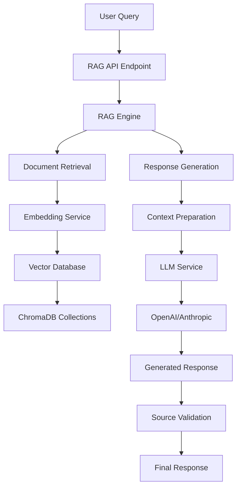

# RAG Code Flow Diagram

## 🔄 Complete RAG Pipeline Flow



## 📊 Detailed Component Interaction

### 1. API Layer → RAG Engine
```python
# app/api/rag.py
@router.post("/query")
async def rag_query(request: RAGQueryRequest):
    response_data = await rag_engine.search_and_generate(
        query=request.query,
        collections=request.collections,
        top_k=request.top_k,
        response_type=request.response_type,
        language=request.language
    )
    return {"success": True, "data": response_data}
```

### 2. RAG Engine → Document Retrieval
```python
# app/services/rag_engine.py
async def search_and_generate(self, query, collections, top_k, response_type, language):
    # Step 1: Retrieve relevant documents
    retrieved_docs = self.retrieve_documents(
        query=query,
        collections=collections, 
        top_k=top_k
    )
    
    # Step 2: Generate grounded response
    response_data = await self.generate_grounded_response(
        query=query,
        retrieved_documents=retrieved_docs,
        response_type=response_type,
        language=language
    )
    return response_data
```

### 3. Document Retrieval Flow
```python
def retrieve_documents(self, query, collections, top_k):
    all_results = []
    
    for collection in collections:
        # Query vector database
        results = self.vector_db.query_documents(
            collection_name=collection,
            query_text=query,
            n_results=top_k
        )
        
        # Format results
        formatted_results = self.embedding_service._format_search_results(results)
        
        # Add metadata
        for result in formatted_results:
            result["metadata"]["collection"] = collection
            result["metadata"]["retrieval_query"] = query
            result["metadata"]["retrieved_at"] = datetime.now().isoformat()
        
        all_results.extend(formatted_results)
    
    # Sort by similarity and return top results
    all_results.sort(key=lambda x: x.get("similarity_score", 0), reverse=True)
    return all_results[:top_k]
```

### 4. Response Generation Flow
```python
async def generate_grounded_response(self, query, retrieved_documents, response_type, language):
    if not retrieved_documents:
        return self._generate_fallback_response(query, language)
    
    # Prepare context from documents
    context = self._prepare_context(retrieved_documents)
    
    # Generate response with LLM
    response_data = await self._generate_response_with_grounding(
        query=query,
        context=context,
        retrieved_documents=retrieved_documents,
        response_type=response_type,
        language=language
    )
    
    # Validate source grounding
    grounding_validation = self._validate_source_grounding(
        response_data["response"], 
        retrieved_documents
    )
    
    response_data.update(grounding_validation)
    return response_data
```

### 5. LLM Integration Flow
```python
async def _generate_response_with_grounding(self, query, context, retrieved_documents, response_type, language):
    # Create system message (LLM role and instructions)
    system_message = self._create_system_message(response_type, language)
    
    # Create user prompt (context + query)
    user_prompt = self._create_user_prompt(query, context, response_type, language)
    
    # Call LLM service
    llm_response = await llm_service.generate_response(
        prompt=user_prompt,
        system_message=system_message,
        max_tokens=self._get_max_tokens_for_response_type(response_type),
        temperature=0.3,
        metadata={
            "query": query,
            "response_type": response_type,
            "language": language,
            "num_sources": len(retrieved_documents)
        }
    )
    
    # Collect sources information
    sources = []
    for i, doc in enumerate(retrieved_documents):
        metadata = doc.get("metadata", {})
        source_info = {
            "id": doc.get("id", f"doc_{i}"),
            "source": metadata.get("source", "Unknown"),
            "category": metadata.get("category", "General"),
            "similarity_score": doc.get("similarity_score", 0),
            "collection": metadata.get("collection", "Unknown")
        }
        sources.append(source_info)
    
    return {
        "response": llm_response.content,
        "sources": sources,
        "context_used": context,
        "query": query,
        "response_type": response_type,
        "language": language,
        "generated_at": datetime.now().isoformat(),
        "num_sources": len(sources),
        "llm_metadata": {
            "provider": llm_response.provider,
            "model": llm_response.model,
            "tokens_used": llm_response.tokens_used,
            "response_time": llm_response.response_time
        }
    }
```

## 🏗️ Class Relationships

```
RAGEngine
├── DocumentEmbeddingService
│   └── VectorDBInterface (ChromaDBService)
├── LLMService
│   ├── OpenAIClient
│   └── AnthropicClient
└── Helper Methods
    ├── _prepare_context()
    ├── _create_system_message()
    ├── _create_user_prompt()
    ├── _validate_source_grounding()
    └── _detect_hallucination_indicators()
```

## 📝 Method Call Sequence

### For Query: "My wheat has orange spots"

1. **API Entry Point**:
   ```python
   POST /rag/query
   ├── RAGQueryRequest validation
   └── rag_engine.search_and_generate()
   ```

2. **Document Retrieval**:
   ```python
   rag_engine.retrieve_documents()
   ├── For collection "crop_diseases":
   │   ├── vector_db.query_documents()
   │   ├── embedding_service._format_search_results()
   │   └── Add metadata (collection, query, timestamp)
   └── Sort by similarity_score
   ```

3. **Response Generation**:
   ```python
   rag_engine.generate_grounded_response()
   ├── _prepare_context() → Format documents for LLM
   ├── _generate_response_with_grounding()
   │   ├── _create_system_message() → Agricultural advisor role
   │   ├── _create_user_prompt() → Context + query
   │   └── llm_service.generate_response() → OpenAI API call
   └── _validate_source_grounding() → Check citations
   ```

4. **LLM Service**:
   ```python
   llm_service.generate_response()
   ├── Determine provider order (OpenAI → Anthropic)
   ├── Check circuit breaker status
   ├── openai_client.generate_response()
   │   ├── Format messages (system + user)
   │   ├── Call OpenAI API
   │   └── Return LLMResponse object
   └── Update metrics and return response
   ```

## 🔍 Data Structures

### Document Structure:
```python
{
    "id": "wheat_rust_doc_123",
    "content": "Wheat rust appears as orange-red pustules...",
    "metadata": {
        "source": "Agricultural Research Institute",
        "crop": "wheat",
        "disease_name": "wheat_rust",
        "category": "disease_management",
        "collection": "crop_diseases",
        "retrieval_query": "wheat orange spots",
        "retrieved_at": "2024-01-15T10:30:00"
    },
    "similarity_score": 0.89
}
```

### LLM Response Structure:
```python
{
    "response": "Based on the symptoms described [Source 1]...",
    "sources": [
        {
            "id": "wheat_rust_doc_123",
            "source": "Agricultural Research Institute", 
            "category": "disease_management",
            "similarity_score": 0.89,
            "collection": "crop_diseases"
        }
    ],
    "context_used": "[Source 1] Agricultural Research Institute...",
    "query": "My wheat has orange spots",
    "response_type": "comprehensive",
    "language": "en",
    "generated_at": "2024-01-15T10:30:15",
    "num_sources": 1,
    "grounding_score": 1.0,
    "is_well_grounded": true,
    "hallucination_risk": false,
    "llm_metadata": {
        "provider": "openai",
        "model": "gpt-3.5-turbo",
        "tokens_used": 456,
        "response_time": 2.3
    }
}
```

## 🎯 Key Integration Points

### 1. **Vector Database Integration**:
```python
# ChromaDB operations
collection.add(documents=docs, metadatas=metadata, ids=ids)
results = collection.query(query_texts=[query], n_results=top_k)
```

### 2. **LLM Provider Integration**:
```python
# OpenAI API call
response = await client.chat.completions.create(
    model="gpt-3.5-turbo",
    messages=[
        {"role": "system", "content": system_message},
        {"role": "user", "content": user_prompt}
    ]
)
```

### 3. **Error Handling Chain**:
```python
try:
    # Primary LLM provider
    response = await openai_client.generate_response()
except LLMError:
    # Fallback to secondary provider
    response = await anthropic_client.generate_response()
except Exception:
    # Final fallback to simple response
    response = self._generate_simple_response_fallback()
```

This diagram shows the complete flow from user query to final response, including all the intermediate steps and data transformations.